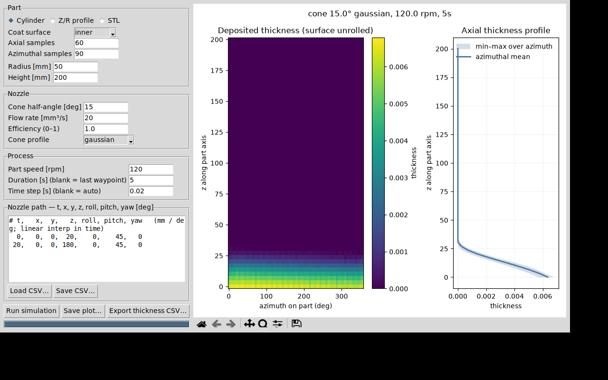
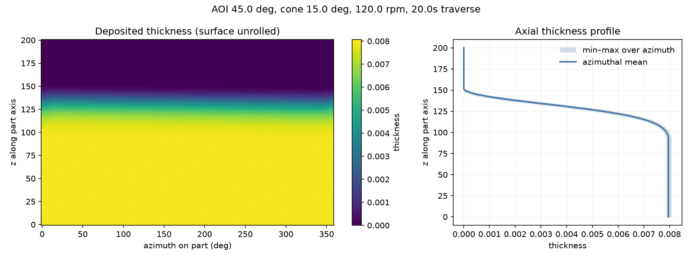

# Spray deposition simulator

`spray_sim.py` simulates spray-coating thickness onto a rotationally
symmetric part spinning at constant angular velocity, from a nozzle with a
conical plume that can move through any x/y/z/roll/pitch/yaw trajectory.

## Physical model

The nozzle emits a volumetric flow rate `Q` inside a cone (half-angle
configurable). Intensity per unit solid angle vs. off-axis angle is
selectable — Gaussian, cosine-power, or uniform — and normalized so the cone
integrates to `Q × efficiency`. The deposition rate on a surface element at
distance `d` with angle of incidence `AOI` is the exact solid-angle
projection:

```
dh/dt = Q · η · f(α) · cos(AOI) / d²
```

Thickness accumulates by explicit time stepping (default: ≤ 4° of part
rotation per step, midpoint rule). Rotation is handled by transforming the
nozzle into the part frame each step, so the surface mesh stays fixed.
There is no occlusion/shadowing test — fine for a nozzle inside a convex
inner surface (e.g. a bore coated from the axis), but concave STL parts
that self-shadow will over-predict.

Units are consistent-but-arbitrary; the examples use mm, s, mm³/s
(thickness comes out in mm).

## Part geometry

* **Z/R profile** — a list of `(z, r)` pairs revolved about the z axis
  (`Part.from_profile`, choose `surface='inner'` or `'outer'`), or
* **STL mesh** — binary or ASCII, loaded with a built-in parser
  (`Part.from_stl`); each facet is one sample. Use `--flip-normals` if the
  mesh winding points away from the spray side.

## Nozzle path

A path is any function `t -> (x, y, z, roll, pitch, yaw)`. Two builders are
provided:

* **`WaypointPath`** — a list of time-keyed waypoints
  `(t, x, y, z, roll, pitch, yaw)` (angles in degrees), linearly
  interpolated per axis at each simulation time step and clamped to the
  first/last waypoint outside the listed range. Load from CSV with
  `WaypointPath.from_csv()` or the `--path-file` CLI option — lines of
  `t,x,y,z,roll,pitch,yaw`, `#` comments and a header row allowed:

  ```csv
  t,  x, y,   z, roll, pitch, yaw
  0,  0, 0,  20,    0,    45,   0
  20, 0, 0, 180,    0,    45,   0
  ```

* **`linear_axial_path()`** — the built-in example: nozzle traversing the
  part axis at a fixed AOI (equivalent to the two-waypoint CSV above).

## GUI

```bash
python spray_gui.py    # requires tkinter (e.g. apt install python3-tk)
```



The left panel sets the part (cylinder, Z/R profile, or STL), nozzle,
process parameters, and the nozzle path as an editable waypoint table
(one `t, x, y, z, roll, pitch, yaw` line each, with CSV load/save). The
simulation runs on a background thread with a progress bar, results render
into the embedded matplotlib panel, and the plot or per-sample thickness
(`x,y,z,nx,ny,nz,area,thickness`) can be exported.

## Nozzle pose and conventions

Part axis = +z. The nozzle spray axis in its body frame is +x, rotated by
intrinsic yaw–pitch–roll. With zero angles the nozzle sprays radially
outward; pitching by `a` degrees tilts the axis toward −z and gives
`AOI = a` on a cylindrical inner wall.

## Quick start

```bash
pip install numpy matplotlib

# Default example: 50 mm-radius, 200 mm cylinder inner wall, 120 rpm,
# nozzle traversing the axis over 20 s at 45° AOI, 15° gaussian cone:
python spray_sim.py -o deposition.png

# Same but from an STL file:
python spray_sim.py --stl part.stl --flip-normals -o deposition_stl.png

# Custom nozzle trajectory from a waypoint CSV:
python spray_sim.py --path-file path.csv

# Knobs:
python spray_sim.py --aoi 30 --cone-angle 10 --profile cosine \
    --rpm 300 --duration 40 --flow-rate 50 --radius 40 --height 150
```

The output figure shows the unrolled thickness map (azimuth × z) and the
axial thickness profile with its min–max band over azimuth.



Note the default 45° AOI points the spray ~`radius·tan(AOI)` below the
nozzle, so the coated band is shifted down relative to the traverse — set
`--z-start/--z-end` to compensate for the lead distance.

## Programmatic use

```python
import numpy as np
from spray_sim import Part, Nozzle, simulate, plot_results

part = Part.from_profile([(0, 50), (150, 50), (200, 30)], surface="inner")
nozzle = Nozzle(cone_half_angle=12, flow_rate=30, profile="cosine")

def path(t):                      # any 6-DOF trajectory
    return (0, 0, 10 + 8 * t, 0, np.deg2rad(40), 0)

thickness = simulate(part, nozzle, path, omega=2 * np.pi * 2, t_end=20)
plot_results(part, thickness, "out.png", "custom part")
```

## Validation

Volume conservation (deposited volume vs. `Q·t` when the whole cone hits
the wall) holds to <1% for all three cone profiles and for both the
profile-revolution and STL geometry paths; profile and STL representations
of the same cylinder agree on the resulting thickness field.
